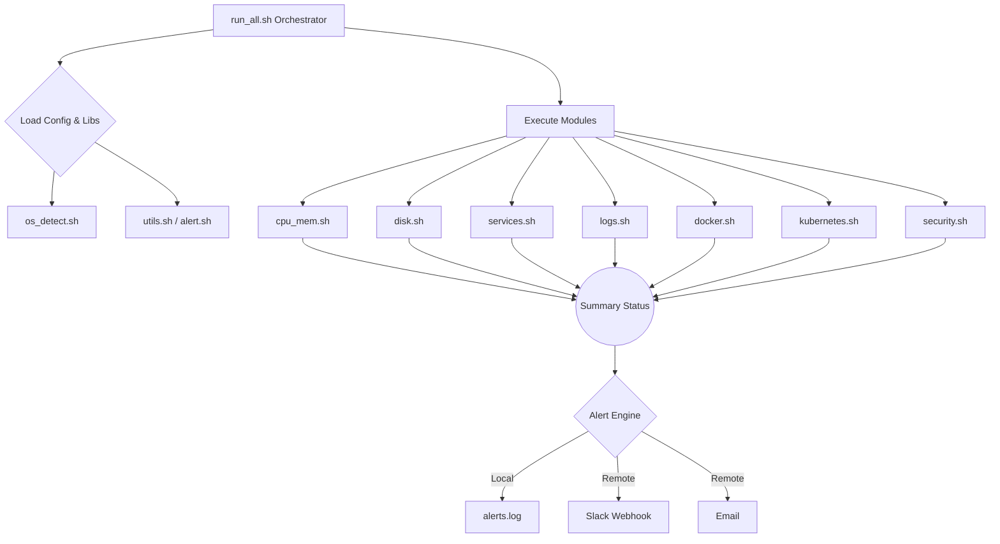

# Linux Monitoring Toolkit 🚀

> A modular, production-grade Linux monitoring and alerting toolkit built with Bash scripting to monitor system resources, analyze logs, inspect services, and understand how real-world Linux systems are operated in DevOps environments.

## 📌 Overview

The **Linux Monitoring Toolkit** is a comprehensive system administration and DevOps project designed to monitor and observe Linux systems without relying on heavy external third-party agents.

While tools like Prometheus, Grafana, and Datadog are industry standards, it is crucial for a DevOps or Cloud Engineer to understand how metrics, log streams, and service states are collected at the OS kernel level. This project focuses on those core fundamentals, demonstrating production-grade Bash scripting, modular design, and robust system observability.

---

## ✨ Key Features & Technical Capabilities

* **📊 Real-time Resource Monitoring**:
  * Tracks CPU load average (1m/5m/15m) and core count.
  * Monitors RAM and Swap consumption with configurable threshold alerts.
  * Detects zombie processes.
  * Captures Top 3 resource-consuming processes sorted by CPU and Memory utilization.

* **💽 Intelligent Disk Monitoring**:
  * Scans mounted filesystems dynamically while strictly filtering out pseudo-filesystems and read-only loop devices (ignores `/snap`, `/proc`, `/sys`, `/dev`, `tmpfs`, `squashfs`).
  * Triggers configurable low-space warnings and critical alerts.

* **⚙️ Service Health Checks**:
  * Checks systemd unit states (`nginx`, `ssh`, `docker`, `cron`, `kubelet`).
  * Graceful fallback logic for non-systemd environments (like WSL1 or minimal containers).

* **🔍 Incremental Log Error Scanning**:
  * Scans `/var/log` files recursively for `ERROR`, `CRIT`, `FATAL`, and custom regex patterns.
  * **Byte-Offset State Tracking**: Remembers the exact byte offset scanned so re-runs only inspect new log entries instead of re-alerting on historical errors.
  * Supports log rotation resilience.

* **🐳 Docker & ☸️ Kubernetes Monitoring (Optional)**:
  * Monitors Docker daemon status, running, and stopped containers.
  * Detects `kubectl` or `k3s`, checking cluster connectivity, Node readiness, and Pod health statuses.
  * Fails gracefully and skips if container runtimes are not installed.

* **🛡️ Security Auditing**:
  * Scans authentication logs (`/var/log/auth.log` or `/var/log/secure`) for failed SSH attempts and `sudo` privilege escalation failures.

* **🚨 Robust Alerting Engine**:
  * Tri-state severity levels: `HEALTHY`, `WARNING`, and `CRITICAL`.
  * Multi-channel alerting via **Slack Webhooks** and **Email (`mailx`)**.
  * **Local-First Resilience**: All alerts are permanently written to `logs/alerts.log` first. Network failures never crash the monitoring run.

---

## 🏗️ Architecture



---

## 📂 Project Structure

```bash
linux-monitoring-toolkit/
├── config/
│   └── toolkit.conf        # Centralized configuration (services, thresholds, webhooks)
├── lib/
│   ├── alert.sh            # Alerting engine (WARNING/CRITICAL)
│   ├── os_detect.sh        # OS, WSL, and systemd detection
│   └── utils.sh            # Standardized logging and terminal color formatting
├── modules/
│   ├── cpu_mem.sh          # CPU, RAM, Swap, Process monitoring
│   ├── disk.sh             # Strict filesystem tracking
│   ├── docker.sh           # Docker daemon and container status
│   ├── kubernetes.sh       # K8s Node and Pod health
│   ├── logs.sh             # Incremental log scanner
│   ├── security.sh         # SSH and sudo audit checks
│   └── services.sh         # systemd unit health checks
├── scripts/
│   └── run_all.sh          # Main execution orchestrator
├── logs/
│   ├── monitor.log         # System report history
│   ├── alerts.log          # Source of truth for triggered alerts
│   └── .offsets/           # State files for incremental log scanning
├── .gitignore
├── CHANGELOG.md
├── CONTRIBUTING.md
├── LICENSE
└── README.md
```

---

## 🚀 Getting Started

### 1️⃣ Clone the Repository
```bash
git clone https://github.com/sudarshanvashisht/linux-monitoring-toolkit.git
cd linux-monitoring-toolkit
```

### 2️⃣ Make Scripts Executable
```bash
chmod +x scripts/*.sh lib/*.sh modules/*.sh
```

### 3️⃣ Configure Toolkit Settings
Edit `config/toolkit.conf` to match your target system services, paths, and threshold preferences:
```bash
nano config/toolkit.conf
```

### 4️⃣ Run the Monitoring Pipeline
```bash
./scripts/run_all.sh
```

---

## ⏰ Automating with Cron

To run the toolkit automatically every 5 minutes:

```bash
crontab -e
```
Add the following entry (adjusting the absolute path to your repository):
```cron
*/5 * * * * /home/youruser/linux-monitoring-toolkit/scripts/run_all.sh --quiet >> /home/youruser/linux-monitoring-toolkit/logs/cron.log 2>&1
```

---

## 💡 Skills Demonstrated & Engineering Focus

* **Production-Grade Resilience**: Avoiding hard failures using graceful fallbacks (`set -uo pipefail`).
* **Modular Design Architecture**: Decoupled libraries, separated configuration, and isolated monitoring modules.
* **State Management in Bash**: Incremental state tracking using byte offsets.
* **Process Concurrency Guarding**: Atomic PID locking to prevent cron overlaps.
* **System Observability**: Deep understanding of `/proc`, `systemd`, `df`, `ps`, and Linux log structures.

---

## 🔮 Future Roadmap

* 📈 Light-weight HTML report generation with chart visualization.
* 🌐 Network connection statistics and port monitoring module.
* ☁️ Cloud Metadata integration (AWS/GCP/Azure instance tags).

---

## 👤 Author

**SUDARSHAN VASHISHT**  
*Aspiring DevOps & Cloud Engineer*  
* GitHub: [@sudarshanvashisht](https://github.com/sudarshanvashisht)

---

⭐ **If you found this repository useful, feel free to give it a star on GitHub!**
